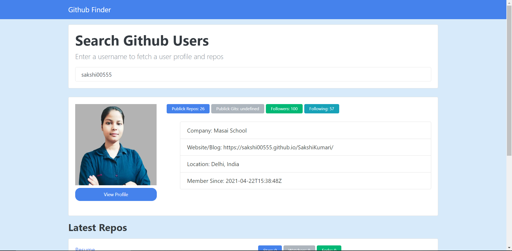

# Github Profile Finder

> This Project is a github profile finder where you can type the username of a github profile in a search input and then you get the results which are a bunch of infos about this user.

## Built With

- HTML, CSS,
- bootstrap 4,
- jQuery,

## Live Demo

[Live Demo Link](https://stately-hotteok-651abc.netlify.app/)

## Getting Started

To get a local copy up and running follow these simple example steps.

### Prerequisites

In order to run this project in your machine you need only a web browser in order to open the index.html file, and maybe a code editor if you want to have some fun with the code

## Author

👤

## Show your support

Give a ⭐️ if you like this project!

